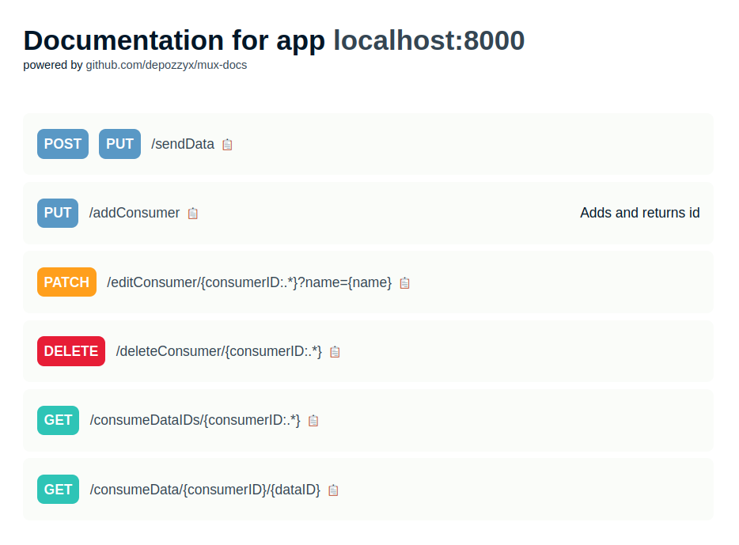

# depozzyx/mux-docs

Automatic documentation for API routes written in Go using gorilla/mux package



Usage:

1.  Navigate to a Go application, that uses gorilla/mux
2.  ```bash
    go get github.com/depozzyx/mux-docs
    ```
3.  Import package in the file, where you init your mux router or add middlewares:
    ```go
    import docs "github.com/depozzyx/mux-docs"
    ```
4.  Add docs middleware:

    ```go
    host := "0.0.0.0:8000" // your app host
    router := mux.NewRouter()

    // router.HandleFunc(...)

    docsMiddleware := docs.Middleware(router, host)
    http.ListenAndServe(host, docsMiddleware(router))
    ```

5.  Run your project! Docs endpoint will be displayed in logs

Full test server code in [example/main.go](example/main.go)
